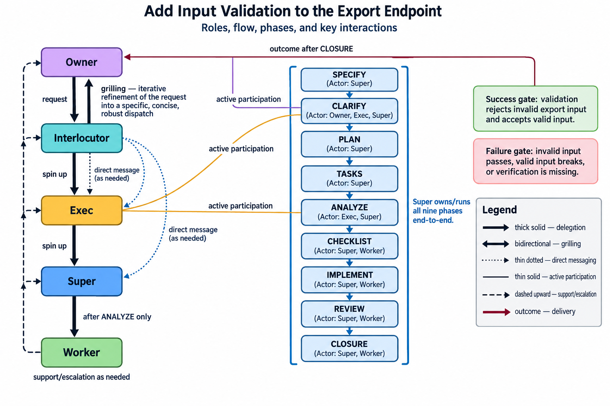

# agents_Inc

Pool free model capacity with existing Claude and Codex subscriptions to increase accepted work per dollar without lowering the verification standard.


[](https://github.com/domattioli/agents_Inc/actions/workflows/tests.yml)

[](https://github.com/domattioli/agents_Inc/issues)
[](https://github.com/domattioli/agents_Inc/issues)
[](https://doi.org/10.5281/zenodo.22670100)

**How to use:** `PYTHONPATH=. python3 tools/governance_demo.py --fake` — exercises governed routing, policy checks, and ledger recording with no provider keys required; see [Getting started](#getting-started) for real-provider setup.

1. [Why pool model capacity](#1-why-pool-model-capacity)
2. [Asking for work in plain language](#2-asking-for-work-in-plain-language)
3. [How the speckit pipeline and grilling are adapted here](#3-how-the-speckit-pipeline-and-grilling-are-adapted-here)
4. [How the governed pool works](#4-how-the-governed-pool-works)
5. [Project status](#5-project-status)
6. [Where it fits](#6-where-it-fits)
7. [Limitations](#7-limitations)
8. [Future work](#8-future-work)
9. [Getting started](#9-getting-started)
10. [Appendix: HTTP bridge](#10-appendix-http-bridge)

<div align="right"><a href="#agents_inc"><sub>^ Back to top</sub></a></div>

## 1. Why pool model capacity

Delegated work can look successful while being wrong. In this project's own build history, two defects (a wrong `resume` argument order, a missing `--skip-git-repo-check`) passed a subagent's own smoke tests and were only caught when a supervisor read the code directly ([specs/001-codex-delegation-regime/tasks.md](specs/001-codex-delegation-regime/tasks.md)).

`agents_Inc` pools free Gemini, Mistral, and OpenRouter capacity with already-paid Claude and Codex subscriptions. The goal is more accepted work per dollar. Cheap models handle eligible routine work. Costlier models supervise, review, and take over only when evidence justifies escalation.

An accepted task must pass independent checks. Savings and accuracy have not yet been measured, so the project does not claim a savings percentage or quality improvement ([docs/PLAN-MVP.md](docs/PLAN-MVP.md)).

Formerly `agents_for_dummies`. The repository was renamed on 2026-09-07 without rewriting its history.

<div align="right"><a href="#agents_inc"><sub>^ Back to top</sub></a></div>

## 2. Asking for work in plain language

You don't hand-pick every model or write JSON. Name two **rungs** (cost and capability classes: Executive, Orchestrator, Workhorse, Grunt) in plain English; the rest fills in.

### Worked example: name two, get four

The ladder has four rungs — Executive, Orchestrator (a.k.a. Supervisor), Workhorse, Grunt — each a Claude/Codex model pair ([docs/governance/ROUTING-RANKING.md](docs/governance/ROUTING-RANKING.md)). You typically only need to name the top two:

**Rung ladder (name these two — the rest derive):**

```
                    CAPABILITY (complex reasoning, judgment, tool coordination)
                                    ↑
                                    │
┌─────────────────────────────────────────────────────────────────┐
│                                                                  │
│  ★ EXECUTIVE                                                    │
│    ├─ Claude: Fable 5          ← Name this one                 │
│    └─ Codex: Astra             ← OR this one                   │
│    Role: Final say, irreversible acts, conflicting results      │
│                                                                  │
├─────────────────────────────────────────────────────────────────┤
│                                                                  │
│  ★ ORCHESTRATOR (Supervisor)                                   │
│    ├─ Claude: Opus 5           ← Name this one                 │
│    └─ Codex: Sol               ← OR this one                   │
│    Role: Decompose, dispatch, complex planning                 │
│                                                                  │
├─────────────────────────────────────────────────────────────────┤
│                                                                  │
│  WORKHORSE                                                       │
│    ├─ Claude: Sonnet 5         ← Derives automatically         │
│    └─ Codex: Terra                                             │
│    Role: Normal coding, research, synthesis                     │
│                                                                  │
├─────────────────────────────────────────────────────────────────┤
│                                                                  │
│  GRUNT                                                           │
│    ├─ Claude: Haiku 4.5        ← Derives automatically         │
│    └─ Codex: Luna                                              │
│    Role: Routine classification, extraction, summarization      │
│                                                                  │
│  (Optional: Gemini, Mistral, OpenRouter free tiers at Grunt)    │
│                                                                  │
└─────────────────────────────────────────────────────────────────┘
                                    │
                                    ↓
                    COST (cheapest → most expensive)
```

> "Use Fable 5 as Executive and Opus 5 as Orchestrator for this refactor."

That's enough. Executive owns final say and irreversible calls; Orchestrator decomposes and dispatches. Workhorse and Grunt — the models that do the actual coding, research, and classification — derive from the same rung table, no need to name them by hand.

### Layering on constraints

Real dispatch prompts add more than a model name. The full list is 14 required elements (the **delegation prompt contract** — a binding set of 14 fields required in every dispatch, enforced under the hood by [skills/workerbee/SKILL.md](skills/workerbee/SKILL.md) Step 11) — you don't type all 14 yourself, but three show up often enough to know by name:

- **Success gate / failure gate**, stated separately — what "done" looks like (success gate: the objective that marks task completion) and what counts as a miss (failure gate: the hard stop that rejects the task), so a delegate's own PASS claim isn't the final word.
- **Effort level** — `low|medium|high|xhigh|max` (Claude) or the same plus `ultra` (Codex), defaulting to medium if you don't name one.
- **Scope boilerplate** — repo-scoped writes only, no commit/push, no credential or cross-repo writes; commit/push authority stays with the run root.

Add whichever of these you care about; the rest of the contract's elements are filled in automatically. See `CLAUDE.md` and `skills/workerbee/SKILL.md` Step 11 for the complete, current list.

<div align="right"><a href="#agents_inc"><sub>^ Back to top</sub></a></div>

## 3. How the speckit pipeline and grilling are adapted here

This repo's custom speckit binding runs an autonomous phase chain: `skills/speckit-pipeline/scripts/resolve_rung.py` resolves each phase's rung name live against `docs/governance/ROUTING-RANKING.md` (fails closed on an unknown rung), and `ledger_bridge.py` passively records every dispatch and return in an append-only ledger; phases themselves still run through the `Agent` tool.

Executive decides gates, accepts or rejects results, resolves conflicts, and handles irreversible acts. Workhorse executes coding, research, and synthesis per gate, reports evidence, and never self-accepts. Separation keeps acceptance independent of the worker's own confidence.

Automation can prepare, route, record, verify, and close routine work. Phases marked unattended may run without a live operator; Executive gates remain required for authority, ambiguity, risk, and acceptance.



Machine-readable version (Mermaid + phase-actor table): [docs/governance/DELEGATION-MODEL.md](docs/governance/DELEGATION-MODEL.md).

**Grilling.** CEO decision sessions only. Their output is a ruling in `docs/DECISIONS.md` or delegation context for the next action. It is not a packaged execution step.

**Speckit pipeline phases (five-stage flow with ledger records):**

```
Phase 1: SPECIFICATION
├─ Task: Author requirements and resolve ambiguity
├─ Output: Spec document + verified success/failure gates
├─ Ledger: Record task + resolved rung
├─ Mode: Unattended only after Executive scope gate
└─ Next: Phase 2

      ↓

Phase 2: PLAN
├─ Task: Decompose into subtasks, assign rungs, set risk gates
├─ Output: Step-by-step plan + dispatch matrix
├─ Ledger: Record plan, rung, and authority for each subtask
├─ Mode: Unattended when scope and risk gates are set
└─ Next: Phase 3

      ↓

Phase 3: IMPLEMENTATION
├─ Task: Execute through the Agent tool
├─ Output: Completed subtasks, worker returns, decision nodes
├─ Ledger: Record dispatch, return, and worker metadata
├─ Mode: Workhorse executes; Executive decides exceptions
└─ Next: Phase 4

      ↓

Phase 4: REVIEW
├─ Task: Cross-vendor verifier + reviewer gates (see Section 4)
├─ Output: Acceptance decision + rationale
├─ Ledger: Record verification and reviewer consensus
├─ Mode: Unattended checks allowed; Executive owns acceptance
└─ Next: Phase 5

      ↓

Phase 5: CLOSURE
├─ Task: Integrate verified outputs, mark task done
├─ Output: Final deliverable + close ledger run
├─ Ledger: Record closure + link to PR/commit
├─ Mode: Unattended after acceptance gate
└─ End: Task complete
```

<div align="right"><a href="#agents_inc"><sub>^ Back to top</sub></a></div>

## 4. How the governed pool works

**Routing** (selecting the vendor and rung for each task based on cost, capability, and policy) uses four rungs: Grunt, Workhorse, Orchestrator, and Executive. Each rung names one Claude model and one Codex model. Gemini, Mistral, and OpenRouter can enter only at Grunt, and only for `extract` and `summarize` tasks. `workerbees/router.py` enforces that boundary and selects the vendor and model for each dispatch ([workerbees/routing.json](workerbees/routing.json), [workerbees/router.py](workerbees/router.py)). **Policy** (the governance rules that determine which models are allowed for which task classes and under what conditions) is encoded in `routing.json` and checked before dispatch.

Moving to a costlier rung requires a recorded reason: repeated failed checks or a provider quota pause. Worker confidence is not an escalation reason.

Verification runs in this order:

1. **Verifier** (deterministic code checks, no model call): `workerbees/verifier.py` checks cited claims against source text without calling a model — e.g., quote accuracy, file existence, hash match.
2. **Reviewer** (cross-vendor semantic review, a model-based check): `workerbees/reviewer.py` performs semantic review using a different provider (different vendor from the worker, when possible). It returns `same_vendor` without making a model call when reviewer and worker providers match, signaling a need for manual review.
3. **Ledger** (append-only audit trail recording every decision): `workerbees/ledger.py` records dispatches, returns, reviews, and acceptance decisions in an append-only audit trail, dual-written by default to JSONL and SQLite for auditability and queryability.

A worker's own PASS or FAIL is never the final verdict. Acceptance follows verifier and reviewer results recorded in the ledger ([workerbees/pipeline.py](workerbees/pipeline.py)).

**Verification pipeline flow (with timing and decision gates):**

```
Worker Task
│
└──→ [WORKER] (via dispatch gateway or Agent tool)
     ├─ Output: candidate response
     ├─ Latency: depends on model + task
     ├─ Cost: 1 × worker rung model cost
     └─ Metadata: logged to ledger as node

           ↓ (immediate)

     [VERIFIER] (deterministic, no model call)
     ├─ Task: Check cited claims against source text
     │        (file existence, quote accuracy, hash match, arithmetic)
     ├─ Latency: ~100–500ms (sync, same-process)
     ├─ Cost: $0 (code only)
     ├─ Result: PASS or FAIL
     └─ Metadata: logged to ledger as verification node
     
     ├─ FAIL path: Stop. Record failure. Return to human.
     └─ PASS path: Continue to reviewer

           ↓ (async, parallel with other tasks possible)

     [REVIEWER] (cross-vendor model call)
     ├─ Task: Semantic review using different provider
     │        (Does output answer the question? Is reasoning sound?
     │        Do claims align with verifier's fact-check?)
     ├─ Latency: ~2–20 seconds (model inference, typically async)
     ├─ Cost: 1 × reviewer rung model cost
     │         (may differ from worker rung; routed by reviewer.py)
     ├─ Result: PASS, FAIL, or SAME_VENDOR
     │          (SAME_VENDOR = no call made; return to human)
     └─ Metadata: logged to ledger as review node
     
     ├─ FAIL path: Stop. Record failure + reviewer rationale. Return to human.
     ├─ SAME_VENDOR path: Stop. Flag for manual review (cache hit).
     └─ PASS path: Continue to ledger + acceptance

           ↓ (immediate)

     [LEDGER] (append-only dual-write: JSONL + SQLite)
     ├─ Task: Record all dispatch metadata, worker output, verifications,
     │        review result, and acceptance decision
     ├─ Dual-write:
     │    ├─ JSONL: ~/.workerbees/ledger.jsonl (human-readable, append-only)
     │    └─ SQLite: ~/.workerbees/ledger.db (queryable, indexed)
     ├─ Cost: $0 (disk I/O only)
     ├─ Latency: ~10–50ms per node
     └─ Output: Run summary + decision record

           ↓

     [DECISION] → ACCEPTED (pass all gates) or NEEDS_REVIEW (human override)

Example: 500-word summary task
├─ Worker (Haiku): 2 sec + $0.01
├─ Verifier: 0.2 sec + $0
├─ Reviewer (Terra): 8 sec + $0.04
├─ Ledger: 0.05 sec + $0
├─ Total: ~10 sec + $0.05
└─ Decision: PASS (if verifier + reviewer agree)
```

Today's schema still requires a Claude model name and a Codex model name at every tier; allowing either subscription to be optional is a goal of the pooling design, not current behavior ([workerbees/config_schema.py](workerbees/config_schema.py), [workerbees/keys.py](workerbees/keys.py)).

<div align="right"><a href="#agents_inc"><sub>^ Back to top</sub></a></div>

## 5. Project status

**Pre-MVP and under active development.** The build plan and cut line live in [docs/PLAN-MVP.md](docs/PLAN-MVP.md).

Built and tested today:

- The four-rung router and optional-provider restrictions.
- Deterministic citation verification and enforced cross-vendor semantic review.
- An append-only JSONL and SQLite ledger.
- A local SHA-256 content-addressed artifact store.
- The governed dispatch gateway, including envelope, policy, registry, and budget checks.
- The live `agent.sh`/`agent_runner.py` dispatch path (shells out to the Codex CLI directly; `bridge.py` is a separate HTTP path for a second device, see appendix).
- 462 automated tests passing locally with `python3 -m unittest discover -s tests`.

`WORKERBEES_GOVERNANCE` still defaults to `off`. The governed path therefore exists but is not enabled by default ([workerbees/gateway.py](workerbees/gateway.py)).

The `gask.sh`, `mask.sh`, and `oask.sh` scripts are the free-tier legacy path. They still work when governance is off, are refused in governed lanes, and are planned to be folded into the governed dispatcher.

Bindle Backend A is built: the local content-addressed artifact store captures and retrieves run output, and `WORKERBEES_ARTIFACTS` defaults to `local`. Backend B remains deferred; it requires an idempotent `finish_run` terminal event and a validated invoice mapping before any real `deislabs/bindle` installation or publication path.

<div align="right"><a href="#agents_inc"><sub>^ Back to top</sub></a></div>

## 6. Where it fits

`agents_Inc` is an integration and governance layer above provider tools. It does not replace their CLIs or instruction formats.

| Provider tool | Used here | Changed | Notes |
|---|---|---|---|
| Claude Skills (SKILL.md format) | Yes | No — standard frontmatter | Packages routing and verification judgment as reusable prose (`skills/workerbee`, `skills/codex-bridge`) |
| Claude subagents / Agent tool | No | — | Single-vendor; cannot enforce cross-vendor review by itself |
| Claude Code hooks | No | — | None configured; a future hook could run tests after edits or guard `routing.json` changes |
| Model Context Protocol (MCP) | No | — | Dispatch uses an HTTP bridge and CLI wrapper |
| OpenAI Codex CLI | Yes | Wrapped | `bridge.py` adds a persistent-thread HTTP session; `agent.sh` and `agent_runner.py` add a governed asynchronous job queue bound to the ledger |
| OpenAI Assistants / Agent SDK | No | — | Uses the Codex CLI and this repository's dispatcher |
| Built here, no vendor equivalent | — | — | `ledger.py` (audit trail), `reviewer.py` (cross-vendor enforcement), `verifier.py` (deterministic pre-check), `artifacts.py` (content-addressed store), `router.py`/`routing.json` (tier and vendor routing) |

This repository is for developers who use more than one model provider, want to control incremental spend, and need delegated work checked independently before acceptance.

<div align="right"><a href="#agents_inc"><sub>^ Back to top</sub></a></div>

## 7. Limitations

The project has not yet measured cost savings or accuracy against its baseline. Local passing tests establish that the implementation behaves as coded, not that it is reliable in production. `WORKERBEES_GOVERNANCE` remains off by default, so the enforced-review path this repository is built around is not the path a fresh checkout runs.

Cross-vendor review catches disagreement between models; it does not catch a shared blind spot both vendors have. Deterministic verification checks what a check can express (citations exist, a file changed, a command exit code) and does not substitute for a human judgment call on scope or design quality. Bindle Backend B (remote artifact publication) is unimplemented, so artifacts stay local-only today.

<div align="right"><a href="#agents_inc"><sub>^ Back to top</sub></a></div>

## 8. Future work

Tracked as open issues on this repo:

- [#7](https://github.com/domattioli/agents_Inc/issues/7) — a CLI-agnostic dispatch mechanism, the inverse of `codex-bridge`, so Codex can drive the same workflow and call Claude models.
- [#8](https://github.com/domattioli/agents_Inc/issues/8) — `astra` dispatch with `--approve-for-me` can hit host-classifier blocks that `terra`/`luna` do not.
- [#6](https://github.com/domattioli/agents_Inc/issues/6) — `codex-bridge`'s `up.sh` hardcodes a stale pre-rename `BASE` path; `--workdir` doesn't override it.
- [#4](https://github.com/domattioli/agents_Inc/issues/4) — a dispatch-prompt style-compression template, with findings and a validation plan.
- [#3](https://github.com/domattioli/agents_Inc/issues/3) — brainstorm: mandate the speckit workflow for Supervisor-rung work.

<div align="right"><a href="#agents_inc"><sub>^ Back to top</sub></a></div>

## 9. Getting started

### Install and configure providers

Run the project from the repository root. Its Python code uses the standard library, so there is no Python package-install step.

**Setup decision tree — follow the path that matches your setup:**

```
Do you have Claude Code CLI installed + authenticated?
├─ NO → Install via https://claude.ai/code (Anthropic account required)
│       └─ After install, continue below at "Do you have Codex..."
├─ YES → Do you have Codex CLI installed + authenticated?
│        ├─ NO → Install via https://openai.com/codex (OpenAI account required)
│        │       └─ After install, continue below at "Ready for..."
│        └─ YES → Do you want to use free-tier providers (Gemini, Mistral, OpenRouter)?
│                 ├─ NO → ✓ Ready for demo (no keys needed; optional providers skipped)
│                 │       └─ Run: PYTHONPATH=. python3 tools/governance_demo.py --fake
│                 └─ YES → Configure free tiers (optional; can skip each one)
│                         ├─ Run: python3 -m workerbees.keys gemini
│                         ├─ Run: python3 -m workerbees.keys mistral
│                         └─ Run: python3 -m workerbees.keys openrouter
│                           (Each opens provider page; press Enter to skip)
│                           ✓ Ready for real jobs (with optional-provider support)
│                           └─ Run: skills/codex-bridge/scripts/agent.sh submit --backend codex --wait "your prompt"
```

**Pick one path:** Either test with `--fake` (no provider keys needed) OR configure optional providers for production use.

**Key storage:** Each optional-provider command opens the provider's key page and requests a hidden paste. Press Enter to skip that provider. Stored keys go to `~/.config/workerbees/.env` with mode `0600`; the agent does not receive the raw key.

**Important:** Never place a key in a command argument or model prompt. Skipping an optional key is not an error. It simply removes that provider from the available pool. Current routing dispatches optional providers only for Grunt-tier `extract` and `summarize` tasks.

> **If you skip a step, return to this tree to verify your path.**

### Quick start

1. Exercise governed routing, policy checks, and ledger recording without provider keys:

```bash
PYTHONPATH=. python3 tools/governance_demo.py --fake
```

The demo runs a fake worker and prints the resulting decision records.

2. After configuring the provider CLIs, submit a real Codex job:

```bash
skills/codex-bridge/scripts/agent.sh submit --backend codex --wait "your prompt"
```

### How it feels to use

**Current workflow (today)**

| Step | User action | System output |
|---|---|---|
| 1. Submit | Run `skills/codex-bridge/scripts/agent.sh submit --backend codex --wait "your prompt"` | Raw model output (no review) |
| 2. Evaluate | Manually inspect output or invoke reviewer path | Accept, reject, or request revision |
| 3. Ledger | (Optional) Record decision if using reviewer | Decision added to ledger |

**Pain points:** manual evaluation for every task, cognitive load on user, no automatic cross-vendor validation, both Claude and Codex logins required even for Codex-only work.

**Planned workflow (beta goal — not yet built)**

| Step | User action | System output |
|---|---|---|
| 1. Submit | `agent.sh submit "your prompt"` | Task queued for execution |
| 2. Optimize | (automatic) Select cheapest eligible provider | Selection logged |
| 3. Execute | (automatic) Run worker at chosen rung | Worker output + metadata |
| 4. Verify | (automatic) Deterministic verifier + cross-vendor reviewer | Verification results |
| 5. Accept | (automatic if gates pass, manual otherwise) Review ledger entry | Verified result + ledger entry |

**Gains:** one-liner submit, automatic provider selection by cost, independent cross-vendor review before acceptance, ledger tracking every decision, credential reuse (only needed provider).

**Status:** ⚠️ **Not yet built** — verification and reviewer paths exist and are tested in isolation ([docs/PLAN-MVP.md](docs/PLAN-MVP.md)). End-to-end automation is a beta milestone, tracked in [docs/PLAN-MVP.md](docs/PLAN-MVP.md) as phase 2 goal.

### Requirements

- Python 3.9 or later. The test suite also runs on Python 3.14 ([specs/001-codex-delegation-regime/plan.md](specs/001-codex-delegation-regime/plan.md), [specs/002-dispatch-graph-ledger/plan.md](specs/002-dispatch-graph-ledger/plan.md)).
- Bash 3.2 or later. The lifecycle and client scripts support macOS system Bash.
- Claude Code CLI, authenticated through an Anthropic subscription.
- Codex CLI, authenticated through a ChatGPT/OpenAI account.
- Optional: Gemini, Mistral, or OpenRouter API credentials. A missing optional key skips that provider rather than blocking the system.

No LICENSE file exists yet.

### Documentation map

| File | Reader |
|---|---|
| [docs/START-HERE.md](docs/START-HERE.md) | New to the system, plain language |
| [docs/HOW-IT-WORKS.md](docs/HOW-IT-WORKS.md) | Operator or agent, dense reference |
| [docs/EXTENDING.md](docs/EXTENDING.md) | Adding a vendor, model, task class, or domain |
| [docs/PLAN-MVP.md](docs/PLAN-MVP.md) | Build plan, cut line, architecture, and phases |
| [docs/DECISIONS.md](docs/DECISIONS.md) | Binding rulings, rationale, and evidence |
| [docs/HANDOFF.md](docs/HANDOFF.md) | Continuing the work in a fresh session |
| [skills/workerbee/SKILL.md](skills/workerbee/SKILL.md) | Full supervision discipline |

<div align="right"><a href="#agents_inc"><sub>^ Back to top</sub></a></div>

## 10. Appendix: HTTP bridge

`bridge.py` exposes the local `codex` CLI over authenticated HTTP for a second device. It is peripheral to the MVP and uses one serialized Codex thread across requests ([bridge.py](bridge.py)).

<details>
<summary>Bridge API reference</summary>

### Run

```bash
export CODEX_BRIDGE_TOKEN=$(openssl rand -hex 32)
python3 bridge.py --port 8787
```

`--workdir DIR` sets the Codex working directory; the default is the current directory. The directory need not be a Git repository because the bridge passes `--skip-git-repo-check`. The default bind address is `127.0.0.1`, the default execution timeout is 60 seconds, and the default Codex sandbox is `workspace-write`.

### Persistent sessions

The bridge maintains one Codex thread across requests. Each prompt reuses the current `thread_id`; send `"reset": true` with a prompt or call `POST /reset` to start a new thread.

### Endpoints

`GET /health` requires no authentication.

```bash
curl http://127.0.0.1:8787/health
# {"status":"ok"}
```

`GET /session` returns the current thread and sandbox. A null `thread_id` means the next prompt starts a new thread.

```bash
curl \
  -H "X-Auth-Token: $CODEX_BRIDGE_TOKEN" \
  http://127.0.0.1:8787/session
```

`POST /reset` clears the current thread.

```bash
curl -X POST \
  -H "X-Auth-Token: $CODEX_BRIDGE_TOKEN" \
  http://127.0.0.1:8787/reset
```

`POST /prompt` executes a prompt through `codex exec`.

```bash
curl -X POST http://127.0.0.1:8787/prompt \
  -H "X-Auth-Token: $CODEX_BRIDGE_TOKEN" \
  -H "Content-Type: application/json" \
  -d '{"prompt":"explain currying in Haskell","model":"gpt-5-codex"}'
```

The request body accepts `prompt` (required string), `model` (optional), and `reset` (optional boolean). A successful response contains `response`, `thread_id`, `usage`, and session-restart metadata where applicable.

### Status codes

| Status | Meaning |
|---|---|
| 200 | Success |
| 400 | Invalid request body or fields |
| 401 | Missing or incorrect `X-Auth-Token` |
| 404 | Unknown endpoint |
| 413 | Request body exceeds 1 MiB |
| 429 | Codex reported a rate or quota limit |
| 500 | Codex CLI unavailable or an unhandled bridge error |
| 502 | Codex exited unsuccessfully; a failed session resume is retried once as a fresh thread unless rate-limited |
| 504 | Codex exceeded the configured timeout |

### Exposing it

A private network or authenticated tunnel can carry the bridge to another device. Tailscale Serve, cloudflared, and ngrok are possible transports; their installation and security properties are outside this repository.

### Security

The bearer token is the bridge's authentication gate. Successful requests can direct a Codex process in the configured working directory and sandbox. Protect the token as a secret, rotate it when exposed, and retain the default `127.0.0.1` binding unless an authenticated network layer is in place.

</details>
