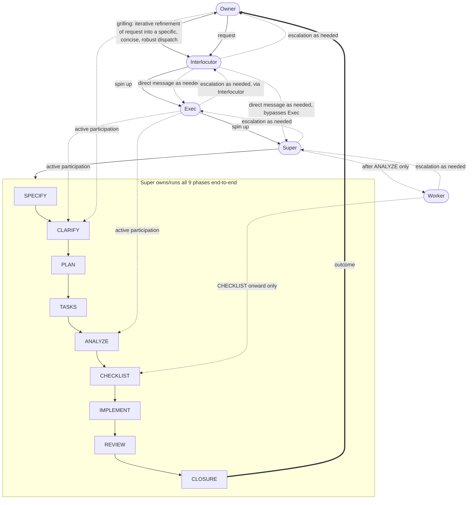

# Delegation model

Machine-facing. Caveman ultra. Canonical figure for P2 (labor ladder) + speckit pipeline phase ownership. Cross-referenced from `AGENTS.md` and `.specify/memory/constitution.md` P2 — not restated there (P0).

Example request used throughout: "add input validation to the export endpoint."

## Roles (abstract, map to P2 rungs)

- Owner → operator (human)
- Interlocutor → whichever agent/model receives the Owner's request first
- Exec → Executive rung (fable/astra)
- Super → Orchestrator/Supervisor rung (opus/sol)
- Worker → Workhorse/Grunt rung (sonnet/terra, haiku/luna, free grunts)

## Chains

- Primary (top-down, solid): Owner → Interlocutor → Exec → Super → Worker. Super→Worker only fires after ANALYZE.
- Grilling (bidirectional, precedes Exec spin-up): Owner ↔ Interlocutor.
- Direct messaging (dotted, as-needed side channel, distinct from primary chain): Interlocutor → Exec, Interlocutor → Super (bypasses Exec).
- Support/escalation (dashed, bottom-up): Worker → Super → Exec → Interlocutor → Owner. Not mandatory per-phase approval — Exec's defining act is spinning up + backstopping Super, never gating every phase.
- Outcome: Closure → Owner.

## Phase-actor matrix (P2 pipeline phases)

| Phase | Owner | Exec | Super | Worker |
|---|---|---|---|---|
| SPECIFY | — | — | YES | — |
| CLARIFY | YES | YES | YES | — |
| PLAN | — | — | YES | — |
| TASKS | — | — | YES | — |
| ANALYZE | — | YES | YES | — |
| CHECKLIST | — | — | YES | YES |
| IMPLEMENT | — | — | YES | YES |
| REVIEW | — | — | YES | YES |
| CLOSURE | — | — | YES | YES |

## Mermaid (machine-readable)

## Fixes carried by this version (v3)

1. Exec renders as the same shape as every other role — never a decision/gate shape (a prior draft used a diamond, rejected).
2. Exec has active participation in CLARIFY and ANALYZE, not just failure-backstop.
3. Owner has active participation in CLARIFY (in addition to originate/receive).
4. Worker participates only from CHECKLIST onward — never in SPECIFY/CLARIFY/PLAN/TASKS/ANALYZE.
5. Grilling (Owner↔Interlocutor) is shown as its own iterative exchange, distinct from the primary chain.
6. Interlocutor can message Exec and/or Super directly, bypassing the primary chain — shown as dotted side channels.

## Assets

- Static image render: `docs/assets/delegation-model.png` (generated artifact, illustrative only — Mermaid above is the source of truth for automated parsing).
